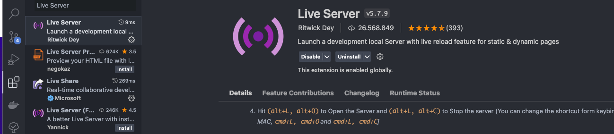

# Titulo mas Grande

## Mini APP

Para que pueda funcionar en el navegador y No bloquee el script:

1. Se coloco el codigo js en el html

2. Si desean utilizar el script en un archivo js diferente. Deberian instalarse una extension en visual studio code para crear un live server.

Extension: Live server

```sh

 Aca va una parte de un codigo

```



